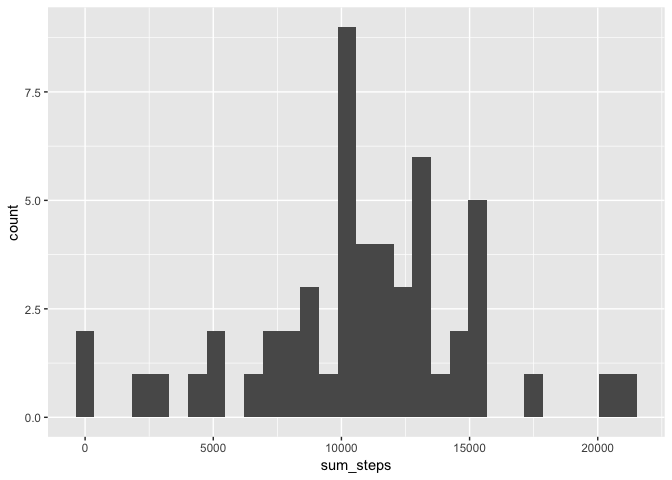
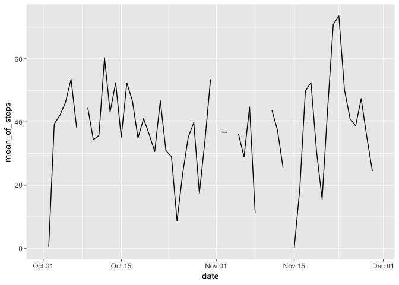
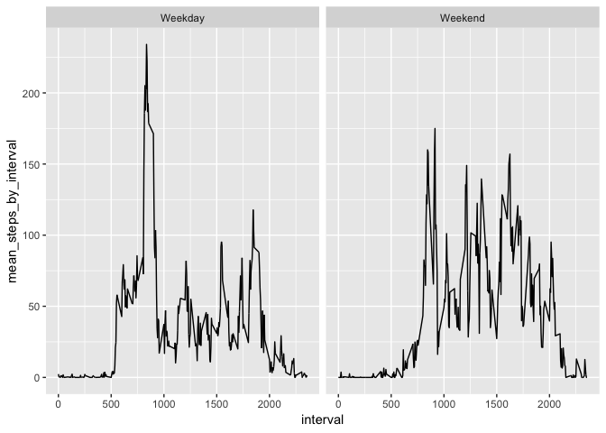

## Load Data

At first we load the activity data.


```r
library(tidyverse)
```

```
## ── Attaching packages ─────────────────── tidyverse 1.2.1 ──
```

```
## ✔ ggplot2 3.1.0       ✔ purrr   0.3.3  
## ✔ tibble  2.1.3       ✔ dplyr   0.8.0.1
## ✔ tidyr   0.8.3       ✔ stringr 1.4.0  
## ✔ readr   1.3.1       ✔ forcats 0.4.0
```

```
## ── Conflicts ────────────────────── tidyverse_conflicts() ──
## ✖ dplyr::filter() masks stats::filter()
## ✖ dplyr::lag()    masks stats::lag()
```

```r
setwd('~/coursera_projects/reproducible_research')
activity = read.csv('activity.csv', header = TRUE)
summary(activity)
```

```
##      steps                date          interval     
##  Min.   :  0.00   2012-10-01:  288   Min.   :   0.0  
##  1st Qu.:  0.00   2012-10-02:  288   1st Qu.: 588.8  
##  Median :  0.00   2012-10-03:  288   Median :1177.5  
##  Mean   : 37.38   2012-10-04:  288   Mean   :1177.5  
##  3rd Qu.: 12.00   2012-10-05:  288   3rd Qu.:1766.2  
##  Max.   :806.00   2012-10-06:  288   Max.   :2355.0  
##  NA's   :2304     (Other)   :15840
```

There are three variables in this dataset: 

* steps: Number of steps taking in a 5-minute interval;
* date: The date on which the measurement was taken in YYYY-MM-DD format
* interval: Identifier for the 5-minute interval in which measurement was taken

## Processing and Plotting Data

### 1. Histogram of the total number of steps taken each day


```r
## Data Transform

activity$date = as.Date(activity$date)


sum_steps_by_dt = activity %>% group_by(date) %>% summarise(sum_steps = sum(steps))

steps_hist = ggplot(data = sum_steps_by_dt, aes(x = sum_steps, y = ..count..))+geom_histogram()
steps_hist
```

```
## `stat_bin()` using `bins = 30`. Pick better value with `binwidth`.
```

<!-- -->

```r
png(filename = './figure/plot1.png')
ggplot(data = sum_steps_by_dt, aes(x = sum_steps, y = ..count..))+geom_histogram()
```

```
## `stat_bin()` using `bins = 30`. Pick better value with `binwidth`.
```

```r
dev.off()
```

```
## quartz_off_screen 
##                 2
```

### 2. Mean and median number of steps taken each day


```r
mean_of_steps = mean(sum_steps_by_dt$sum_steps, na.rm = TRUE)
mean_of_steps
```

```
## [1] 10766.19
```

```r
median_of_steps = median(sum_steps_by_dt$sum_steps, na.rm = TRUE)
median_of_steps
```

```
## [1] 10765
```

### 3. Time series plot of the average number of steps taken

```r
mean_steps_by_dt = activity %>% group_by(date) %>% summarise(mean_of_steps = mean(steps))

ggplot(data = mean_steps_by_dt, aes(x = date, y = mean_of_steps)) + geom_line()
```

```
## Warning: Removed 2 rows containing missing values (geom_path).
```

<!-- -->

```r
png(filename = './figure/plot2.png')
ggplot(data = mean_steps_by_dt, aes(x = date, y = mean_of_steps)) + geom_line()
```

```
## Warning: Removed 2 rows containing missing values (geom_path).
```

```r
dev.off()
```

```
## quartz_off_screen 
##                 2
```

### 4. The 5-minute interval that, on average, contains the maximum number of steps

```r
mean_steps_by_interval = activity %>% group_by(interval) %>% summarise(mean_steps = mean(steps, na.rm = TRUE)) 

max(mean_steps_by_interval$mean_steps)
```

```
## [1] 206.1698
```

### 5. Code to describe and show a strategy for imputing missing data

This easiest way to imput missing data is to remove them.


```r
if(sum(is.na(activity) == TRUE)>0){
    no_missing_activity = activity[complete.cases(activity),]
}
```

### 6. Histogram of the total number of steps taken each day after missing values are imputed

```r
sum_steps_by_dt_new = no_missing_activity %>% group_by(date) %>% summarise(sum_steps = sum(steps))

steps_hist_new = ggplot(data = sum_steps_by_dt_new, aes(x = sum_steps, y = ..count..))+geom_histogram()
steps_hist_new
```

```
## `stat_bin()` using `bins = 30`. Pick better value with `binwidth`.
```

<!-- -->

```r
png(filename = './figure/plot3.png')
steps_hist_new
```

```
## `stat_bin()` using `bins = 30`. Pick better value with `binwidth`.
```

```r
dev.off()
```

```
## quartz_off_screen 
##                 2
```

### 7. Panel plot comparing the average number of steps taken per 5-minute interval across weekdays and weekends


```r
activity_by_weekdays = no_missing_activity %>% 
     mutate(day_of_week = weekdays(date)) %>%
     mutate(weekend = ifelse(day_of_week  == 'Saturday' | day_of_week == 'Sunday','Weekend','Weekday'))

activity_by_weekdays %>% 
     group_by(weekend, interval) %>% 
     mutate(mean_steps_by_interval = mean(steps)) %>% 
     ggplot(aes(x = interval, y = mean_steps_by_interval)) + geom_line() + facet_wrap(~weekend)
```

<!-- -->

```r
png(filename = './figure/plot4.png')
activity_by_weekdays %>% 
     group_by(weekend, interval) %>% 
     mutate(mean_steps_by_interval = mean(steps)) %>% 
     ggplot(aes(x = interval, y = mean_steps_by_interval)) + geom_line() + facet_wrap(~weekend)
dev.off()
```

```
## quartz_off_screen 
##                 2
```
